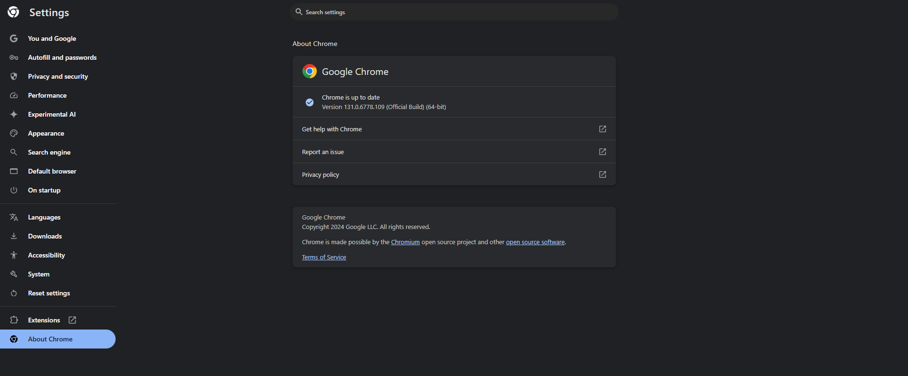
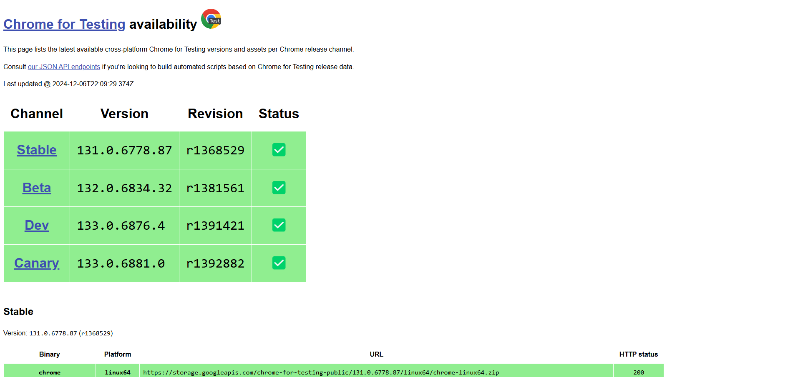
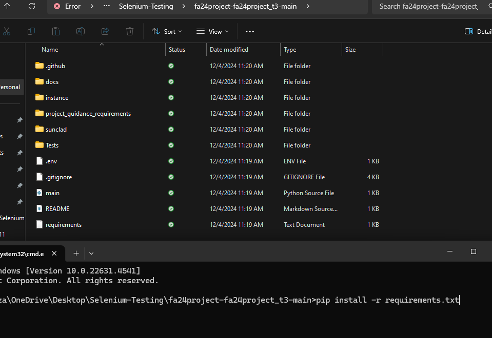
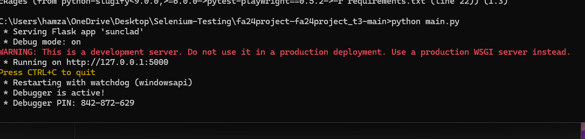
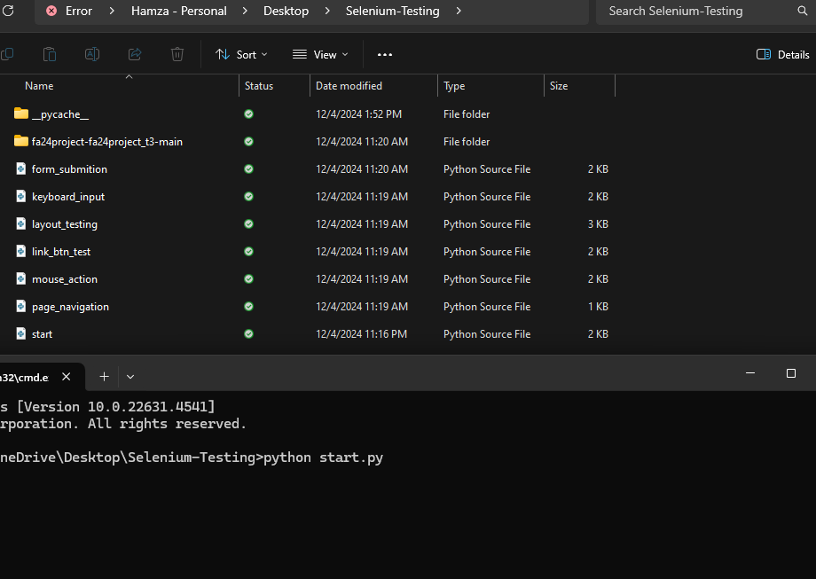

# Selenium Preparation Guide

## Resources
- [Video 1](https://www.youtube.com/watch?v=Xjv1sY630Uc&list=PLzMcBGfZo4-n40rB1XaJ0ak1bemvlqumQ)
- [Video 2](https://www.youtube.com/watch?v=j7VZsCCnptM&t=309s)
- [Video 3](https://www.youtube.com/watch?v=dam0GPOAvVI)

## Introduction to Selenium
Selenium is a powerful open-source framework for automating web browser interactions, widely used for testing web applications and ensuring their functionality across different browsers and environments.

- Open-source tool for web browser automation.
- Widely used for functional and acceptance testing of web applications.
- Extensive Language Support
- Preferred for its simplicity
- Preferred by developers and non-technical testers

## Setup and Installations
Steps to set up and install Selenium:
1. Install Python.
2. Install pip.
3. Using pip install Selenium.

## Web Drives: 
For convenience, we will use Chrome for web automation. To ensure compatibility, it is important to have the latest version of Chrome installed. Start by checking your current Chrome version in the browser's settings. If an update is needed, visit the official Chrome website to download the latest version. Keep in mind that the website and download links are updated regularly.

1. 

2. 

## Running selenium file

1. First we need to install Requirements.txt 
   

2. We need to run the app in this case main.py and leave the server running
   

3. Last step is to open a new command prompt and run the main test file which is start.py
   

